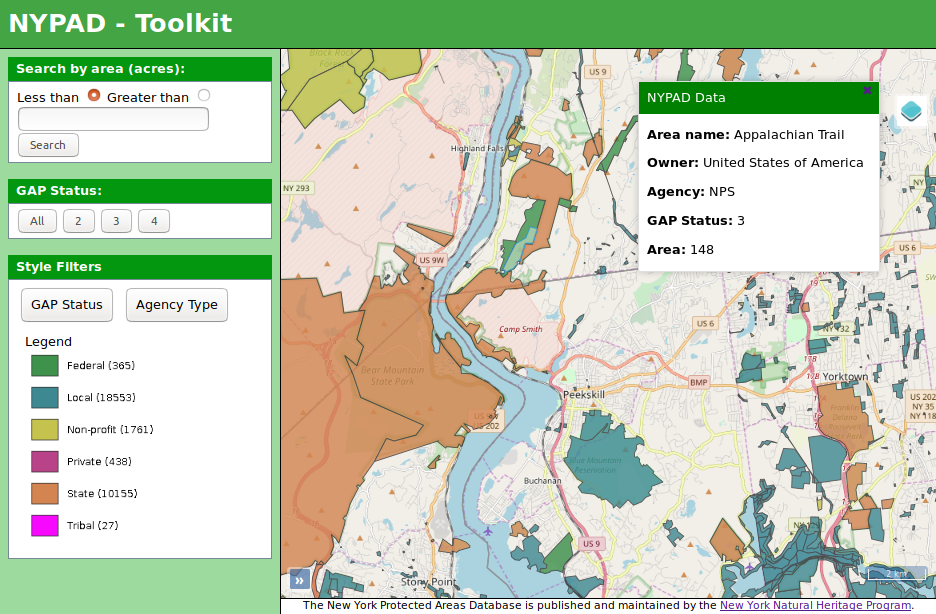

# NYPAD Toolkit

This is an online map viewer based on the [NYPAD interactive map](http://nypad.org/InteractiveMap), and the [CPAD Interactive map](http://www.mapcollaborator.org/cpad/).

These maps show the geographic and administrative information for recognized protected areas. 

## Features
The data is available by courtesy of the [New York Natural Heritage Program](http://www.dec.ny.gov/animals/29338.html)

Layer selection, _style filters_, shows color codings for GAP status and Agency owners.

Complete feature data is printed to the browser console.

## The application stack:
- Openlayers
- GeoServer + PostGis
- NodeJS

## Installation

`npm install`

`npm run start` or `PORT=1234 npm run start`

## Future Development
- More feature attribute data presented in popup
- Drawing tools and separate layer for marking and annotating features

